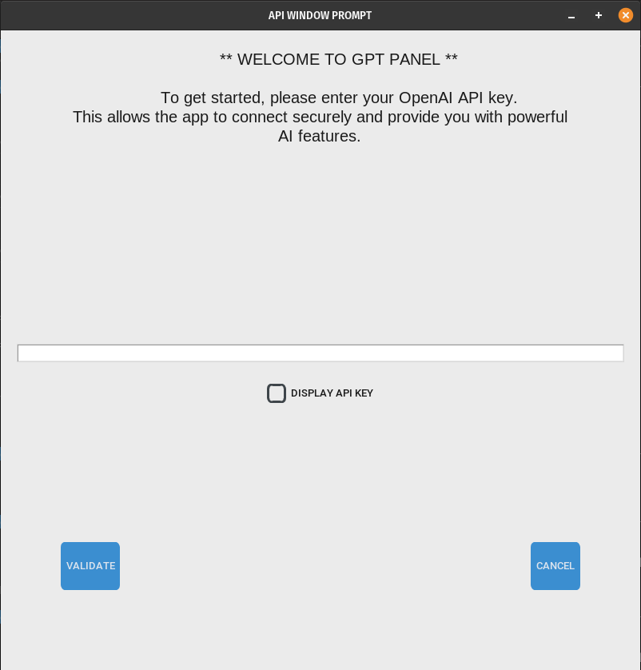
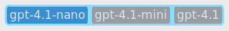
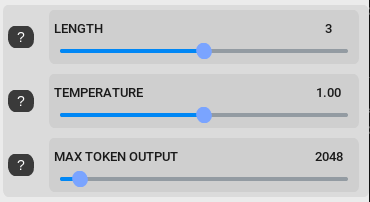

<p align="center">
  
</p>

## 🚀 SYNOPSIS

`gpt_panel` is a modern, fully customizable desktop application for interacting with GPT models via the OpenAI API. Designed with a user-friendly graphical interface using Python and CustomTkinter, it enables rapid prompt/response cycles, model switching, and fine control over generation parameters—making it perfect for both casual and advanced AI users.

The project was originally developed for the CS50P Final Project.

## ✨ FEATURES

Key features of `gpt_panel` include:

- **OpenAI API Integration**  
  Connects securely to OpenAI's GPT models using your own API key.

- **Multi-Model Support**  
  Instantly switch between GPT-4.1, GPT-4.1-mini, and GPT-4.1-nano.

- **Length, Temperature, and Token Controls**  
  Slide to adjust answer verbosity, randomness, and maximum token output.

- **Cost Tracking**  
  Integrated price engine to estimate and display total API usage costs.

- **API Key Management**  
  Secure prompt and local storage for API keys, with easy re-validation.

- **Modern, Responsive Design**  
  Built on CustomTkinter for a polished, cross-platform appearance.

- **Error Handling**  
  Graceful handling of common API and network errors.

## 🖥️ Installation

To get started with `gpt_panel`, follow these steps:

1. **Clone the repository:**
   ```bash
   git clone https://github.com/maitreverge/gpt_panel.git
   ```
2. **Navigate to the project directory:**
   ```bash
   cd gpt_panel
   ```
3. **Install dependencies in a Python Virtual Environment:**
   ```bash
   source ./p_env.sh master
   ```
> [!NOTE]
> The `p_env.sh` is a custom bash script for managing Python Virtual Environment and dependecies.

For more info on this script, run :

```bash
./p_env.sh -h
```
   
4. **Run the application:**
   ```bash
   ./run.sh
   ```
   
The first time you launch the app, you will be prompted to enter your OpenAI API key.

<p align="center">
  
</p>

## ⚙️ USAGE

### Running the App

- The application will prompt for your API key if not found, and store it securely in a local `.env` file.
- Use the sliders and selectors in the GUI to adjust parameters like model, response length, temperature, and max tokens.
- Type your prompt and click "SEND TO GPT" to get a response.

### Model & Parameter Controls

- **Model**: Choose between available GPT-4.1 variants.
<p align="center">
  
</p>

- **Length**: Adjust from concise to extensive responses.
- **Temperature**: Control randomness—lower is deterministic, higher is creative.
- **Max Tokens**: Set the maximum output length.
<p align="center">
  
</p>

## 🗂️ Project Structure

- **gpt_panel/**  
  Main application package.
- **img/**  
  Images and graphical assets for the GUI.
- **assets/**  
  Contains prompt length instructions and other helper files.
- **.cs_50/**  
  Files related to the original CS50 Python project (not required for normal use).
- **requirements.txt**  
  Python dependencies.

## 🚧 Limitations

- Only supports GPT-4.1 model family (update as new models are added).
- Requires a valid OpenAI API key.
- GUI is optimized for desktop and may not scale well to mobile/tablet.
- Advanced features (system prompts, function calls, streaming, etc.) are not yet supported.

## 🧑‍💻 Author

- **Florian VERGE** ([@maitreverge](https://github.com/maitreverge)) – Design, core logic, UI/UX

The project started in 2024 as part of CS50 Python.

## 📜 License

This project is licensed under the [MIT License](LICENSE).

## 🤝 Contributing

Contributions are welcome! Open a GitHub Issue or submit a Pull Request 🚀